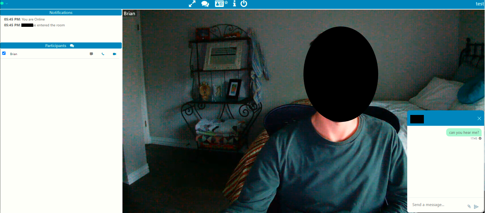

## Zumzi Live Demo



## Features:

- Group Voice and Video Call with unlimited members
- Live Streaming
- Screen Sharing
- Fine control over all video & audio parameters and user permissions
- Supports video streaming at various resolutions: Standard, HD, FHD and 4K
- Group Chat
- One-to-One chat
- Invite Participants

There are two sub-folders:

- **backend** contains the source code for hosting the backend APIs for the app
- **web** contains the source code for the app which you can directly integrate into your website.


## Messenger
Edit `config.js` and provide the `AUTH TOKEN` & `APP ID`. 

You can obtain the `AUTH TOKEN` and `APP ID` for a user from [Mesibo Console](https://mesibo.com/console/). 

Refer to the [Get-Started Guide](https://mesibo.com/documentation/tutorials/get-started) to learn about the basics of mesibo.

To open messenger demo launch `messenger.html` 

```javascript
const MESIBO_ACCESS_TOKEN = "xxxxxxx";
const MESIBO_APP_ID = "xxxx";
const MESIBO_API_URL = "https://app.mesibo.com/api.php"
```
If you are hosting mesibo-backend on your own server, you need to change the API URL to point to your server.  

### Messenger Login
You can synchronize contacts, by using a phone number to login to mesibo messenger-javascript. 

To login to the mesibo messenger web app, in the login screen provide the phone number along with country code starting with `+` For Example, If your country code is `91` and your ten-digit phone number is `XXXXXXXXXX`, enter your phone number as `+91XXXXXXXXXX` (with out any spaces or special characters in between)

Use OTP 123456 to login. Mesibo will generate and store `MESIBO_ACCESS_TOKEN` if login is successful. 

Please note that you only need to login once as for later sessions your token will be stored in local storage.

If you DO NOT wish to login with your phone number, make sure you configure a valid `MESIBO_ACCESS_TOKEN` in  `config.js` and set `isLoginEnabled = false` 


### Synchronizing contacts on Messenger 

To synchronize contacts set `isContactSync = true`

For the best experience using the messenger app, make sure you have some contacts who are using Mesibo Messenger. These contacts will be displayed as a list of available users to whom you can send messages or make calls. Optionally, you can also manually provide a list of phone numbers of contacts who are using mesibo in `MESIBO_LOCAL_CONTACTS` or by clicking on the `Add Contact` button. 

You can provide a list of local contacts that will be loaded as a list of available users. Set local contacts as follows in `config.js`
```
var MESIBO_LOCAL_CONTACTS =[

{       
        "address" : "18885551001",
        "groupid" : 0,
        "picture" : "images/profile/default-profile-icon.jpg",
        "name"    : "MesiboTest",
        "status": "Let's Chat.."
},

{       
        "groupid" : 104661,      
        "picture" : "images/profile/default-group-icon.jpg",
        "name"    : "Mesibo Group",
        "members" : "1:123,456,789"             //Members list. Add 1: to mark as admin
},

]
``` 

## Popup
To launch popup demo you can configure the following for setting the displayed user avatar and destination user(to which all messages will be sent) in `config.js` and launch `popup.html`

```javascript
const POPUP_DISPLAY_NAME = "xxxx"
const POPUP_DISPLAY_PICTURE = "images/profile/default-profile-icon.jpg"
const POPUP_DESTINATION_USER = 'xxxx';
```

## FAQ & Troubleshooting

### Getting `AUTHFAIL` with getcontacts API 
This means the token you have provided in `MESIBO_ACCESS_TOKEN` is not generated or validated with your phone number which is required for synchronizing contacts. 

To generate a token by validating your phone number, make sure you have set `isLoginEnabled = true`. A login screen will then appear during app start, where you can enter your phone number(Example +91XXXXXXXXXX), get an OTP, and log in.

If you do not wish to synchronize contacts, set `isContactSync = false` and provide a list of local contacts in `MESIBO_LOCAL_CONTACTS`. 

### I do not wish to use phone login, what should I do?
Set `isLoginEnabled = false` and make sure that you provide a valid `MESIBO_ACCESS_TOKEN`

### I do not want to synchronize with my phone contacts, how do I configure that?
If you do not wish to synchronize contacts, set `isContactSync = false` and provide a list of local contacts in `MESIBO_LOCAL_CONTACTS`.

### Do I need to log in with my phone number every time I load the app?
No the first time you log in with your phone number with a valid OTP the token will be stored in localStorage. In future loading of the app, the token will be loaded from local storage. Or if you have provided a valid `MESIBO_ACCESS_TOKEN` in `config.js` that will be loaded.    

### Getting $scope.mesibo.X is not a function
Ensure that you perform a hard reload so that you have the latest Mesibo Javascript API


## Install Mesibo Javascript SDK

The easiest way to install Mesibo Javascript SDK is to include following in `<HEAD>` section of your HTML file:

```
<script type="text/javascript" src="https://api.mesibo.com/mesibo.js"></script>
```

You can also use `async` and `defer` attributes inside `script` tag if requires.

Alternatively, you may also use DOM method to load the mesibo JS on demand when it is not possible to use the script tag.

```
const script = document.createElement("script");
script.src = "https://api.mesibo.com/mesibo.js";
document.body.appendChild(script);
```

> You must use a secure website (https) to use mesibo javascript. It may NOT work from `http://` or `file://` sites due to browser security restrictions.

## Notes when using it for Calls and Conferencing

Due to the browser security model, camera and microphone access require the following:

-   You MUST use a secure URL (`https://`). The `http://` or `file://` URLs will NOT work.
    
-   You MUST also use a valid certificate with recognized authority, the self-signed certificate will NOT work.
    

The browser will not grant the camera and microphone permissions unless your app meets the above requirements. If permissions are not granted, calls and conferencing will not work.

These restrictions are by the browsers and NOT by the mesibo. Refer Security section in the [Mozilla documentation](https://developer.mozilla.org/en-US/docs/Web/API/MediaDevices/getUserMedia#security) for more information.


### That’s All!

You can now begin developing features with mesibo.

[javascript chat sdk](https://mesibo.com/documentation/glossary/?term=javascript%20chat%20sdk), [messaging sdk for javascript](https://mesibo.com/documentation/glossary/?term=messaging%20sdk%20for%20javascript), [javascript sdk for chat](https://mesibo.com/documentation/glossary/?term=javascript%20sdk%20for%20chat), [install sdk through javascript](https://mesibo.com/documentation/glossary/?term=install%20sdk%20through%20javascript)